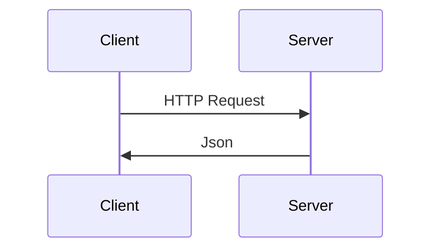

# Apresentação Teórica

## 1. Apresentação do Projeto.

Mostrando o que vai ser feito no curso, as tecnologias e como vai ser feito.

Links passados
`https://my-trips.willianjusten.com.br` - projeto no ar
`https://github.com/react-Avancado/boilerplate` - boilerplate
`https://github.com/willianjusten/my-trips` - Projeto final

## 2. Introdução ao NextJS

NextJS é um framework web desenvolvido com ReactJS

SSR - Server Side Rendering
SSG - Static Site Generation
Styled-JSX
Zero Configuration

Static Site | GatsbyJS, Hexo
Client Side Rendering (Single page Application - SPA) | Creat React App

**Static Site**

> Pega a REST api e o conteúdo estático e coloca na CDN que é um servidor. Quando for abrir o site, ele pega coisa da CDN ao inves de pegar da API.
>
> > **Vantagens**
> >
> > Uso baixo de servidor
> > Pode ser servida em uma CDN
> > Melhor Performance
> > Pode usar em qualquer servidor
> >
> > **Desvantagens**
> >
> > Tempo de build pode ser muito alto
> > Dificuldade para escalar em aplicações grandes
> > Dificuldade para realizar atualizações constantes
>
> **Quando usar**
>
> Site simples sem muita interação do usuário
> Conteúdo de desenvolvedor único
> Conteúdo que nao muda muito
> Simplicidade
> Quando performance for extremamente importante

**Client Side Rendering**

> O site pega html, css e js na CDN. Mas a página nao carrega pois as infos ele ainda vai puxar da REST API depois

**SSR**

> Ao abrir o site o server recebe a chamada e o servidor faz a chamada na API pelas infos. Quando o usuario abre a pagina ela ja vem tudo sem renderizar no client side
>
> > **Vantagens**
> >
> > Ótimo em SEO
> > Meta Tags com previews mais dequados
> > Melhor performance para o usuário
> > Código compartilhado com o backend em Node
> > Menor processamento no lado do usuário
> >
> > **Desvantagens**
> >
> > Time to first byte maior, pois ele vai ter que renderizar tudo antes de entregar algo
> > HTML maior
> > Reload completo nas mudanças de rota, sempre bater no servidor quando precisa de algo
>
> **Quando usar**
> Quando tem necessidade de um SPA mas precisa de um loading rapido
> Quando o conteúdo muda com frequência
> Quando trabalha com um número grande de páginas
> Quando precisa de uma boa indexação no Google
>
> Ex: Ecommerce e Sites de Notícia;

**SPA**

> **Vantagens**
>
> Permite paginas ricas em interações sem recarregar
> Site rápido após o load incial
> Ótimo paras  aplicações web
> possui diversas bibliotecas
>
> **Desvantagens**
>
> Load inicial pode ser muito alto
> performance imprevisível
> Dificuldade no SEO
> Maioria do conteúdo não é indexado
>
> **Quando usar**
>
> Quando nao tem necessidade de indexar informações ao google
> Quando o usuário faz muitas interações na página sem que vc queira refresh's
> Quando as informações vao ser diferentes para cada usuário (autenticação)

Links passados em aula para estudar

` https://nextjs.org/learn/basics/create-nextjs-app` (Tutorial oficial passo-a-passo)
`https://dev.to/kefranabg/demystifying-ssr-csr-universal-and-static-rendering-with-animations-m7d`
(animações vistas nos slides)
`https://marinaaisa.com/blog/cook-websites-based-on-your-needs/` (explicações sobre quando usar um ou outro)
`https://github.com/vercel/next.js/tree/canary/examples` (vários exemplos oficiais do NextJS com outras tecnologias)

## 3. introdução do GraphQL

linguagem de consulta de dados desenvolvida e usada pelo facebook desde 2012

Comparativo de antes e depois do GraphQL

com Rest API



**Uso de rotas com o pattern api**
ex:
	/api/v3/user/id
	/api/v4/user/id
	etc...

**Problemas**

> Dificuldades para evoluir a API
>
> Entrega de dados nem sempre necessários
>
> > como fazer requisição so da foto do usuario e ele retornar todas as infos do perfil
>
> Aumento do tamanho da requisição
>
> Rotas acopladas

**Agora com o GraphQL**

Prepara um Schema

```
 type User {
	name: String
	bio: String
	avatarUrl: String
	createdAt: DateTime!
	followers: FollowersConnection
}
type FollowersConnection {
	edges: [UserEdge]
	nodes: [User]
	totalCount: Int!
}
```

podendo fazer a requisição somente dos valores pedidos como:

```
 query {
	user(login: "willianjusten"){
		name
		location
		followers {
		totalCount
		}
	}
}
```

O fluxo segue sendo o mesmo da Rest API com relação Cliente -> Servidor

Na prática com a GraphQL do github
`https://docs.github.com/pt/graphql/overview/explorer` 

vem uma query default

```GraphQL
query { 
  viewer { 
    login
  }
}
```

que retorna o usuário da pessoa que está logada vendo aquela tela, no meu caso, jeftemartins

```
 query {
user (login: "jeftemartins"){
	avatarUrl
	bio
	followers {
		totalCount
		}
	}
}

// saída

{
  "data": {
    "user": {
      "avatarUrl": "https://avatars.githubusercontent.com/u/36806973?u=b9c15a3cbf5bfaa16f1f1a08e2b68912ce6d4751&v=4",
      "bio": " 25yo sutent of System and Digital Media at Federal University of Ceará, Brazil.\r\n",
      "followers": {
        "totalCount": 16
      }
    }
  }
}
```

Numa REST Api seria requisitado o 
`{...}/users/jeftemartins`

e todas as informações do meu perfil seriam retornadas, ao inves de enviar somente o que eu preciso.

## 4. Introdução ao CSS-in-JS

**problemas do CSS**

> falta de escopo local
>
> especificidade e novamente, colisão de estilos
>
> codigo nao ustilizado
>
> falta de modularidade
>
> dificuldade na manutenção

**Resoluções para os problemas**

Pré processadores como Less, Sass, Stylus.

**CSS-in-JS**

é um conjunto de ideias para resolver os complexos problemas do CSS.

Algumas das bibliotecas

> Aphrodite
> Emotion
> Glamor
> Styled Components
> Styled JSX
> Outras  (https://github.com/michelebertoli/css-in-js)

Styled Componentes será usado no projeto, o pq veremos nos pontos abaixo

> Critical CSS automático
>
> > Vê o above the fold, que seria o corte inicial da página que será visto primeiramente pelo usuário.
> > Carregará essa parte inicialmente depois o restante
>
> Escopo definido (sem colisão de classes)
>
> > especificará o estilo naquele contexto
>
> Remoção do CSS não utilizado
>
> > se o css nao for usado naquela pagina naquele momento ele nao sera carregado
>
> Estilos dinamicos
>
> > Mudar estilos e componentes baseado no que se passa pros componentes
>
> Manutenção simplificada
>
> Vendor prefixing automático

```jsx
 import styled from 'styled-components'
export const Main = styled.div`
align-items: center;
display: flex;
`
```

como será compilado

```css
 .styled__Main-sc-11b8j8d-1-bSsuBw {
	-webkit-box-align: center;
	-webkit-box-pack: justify;
	align-items: center;
	display: flex;
	justify-content: space-between;
}
```

esse código serve para cada componente ter seu css único

Dinamicidade dependendo do componente

```jsx
 const Button = styled.button`
background-color: ${props => props.primary? 'palevioletred': 'white'};
color: ${props => props.primary? 'white': 'palevioletred' };
render(
	<div>
	<Button>Normal</Button>
	<Button primary>Primary</Button>
	</div>
)
```

## 5. Introdução a Testes de Software

- Código complexo nao se debuga só com o olho
- Testar pe uma forma robusta de **Validar o software**
  - Funciona como eu espero?
  - Funciona como o usuário espera?
  - Se eu atualizar esse trecho, o código quebra?
- Testes funcionam como uma primeira camada de documentação

#### **Tipos de testes**

- **Testes unitários**

  > Testam **isoladamente** pequenas unidades de código
  >
  > O código está se comportando como o **desenvolvedor** espera?

- **Testes Funcionais**

  > Checar se as unidades funcionam também entre si
  >
  > Testes podem conter múltiplas classes, métodos e etc
  >
  > O programa funciona de acordo com o que o **usuário** espera?


#### **Como escreveríamos um teste de um sistema de busca.**

- Expande quando em foco
- Envia uma request para um banco de dados com a palavra digitada
- Recebe dados e renderiza na tela a lista
- Destaca dentro dos itens a string digitada
- Quando não possui nenhum item, mostra uma mensagem

**Como faríamos com testes unitários**

- Isolamos só o componente de busca (criando mock para o serviço)
- Testar cada um dos comportamentos de forma separada.
  - Se o campo recebe focus, ele expande? (ex: adição de classe)
  - Ao ter uma string no campo, o método de fetch API é chamado?
  - A string do campo é passada corretamente para a API e os dados retornados são condizentes?
  - Dado um conjunto de dados recebidos, a lista é renderizada?
  - Se não tiver dados, uma mensagem é preenchida?

**Para os testes funcionais, como faríamos?**

- Aqui não há mais isolamento entre os métodos e nós realizamos o fluxo completo
  - Simula o **usuário** clicando
  - Simula o **usuário** digitando e apagando
  - Simula o **usuário** clicando num item da pesquisa
- E analisa todo o fluxo para ver se o comportamento funciona como esperado

#### TDD  -  Test-Driven development

Guiar pelo teste pq escrever os testes após o desenvolvimento pode enviesar seus testes e trazer problemas

**Usaremos Jest e Cypress**

**Para testar o React será usado o React Testing Library**
